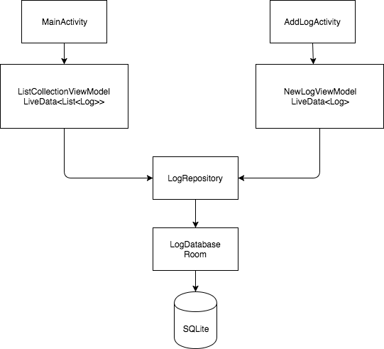
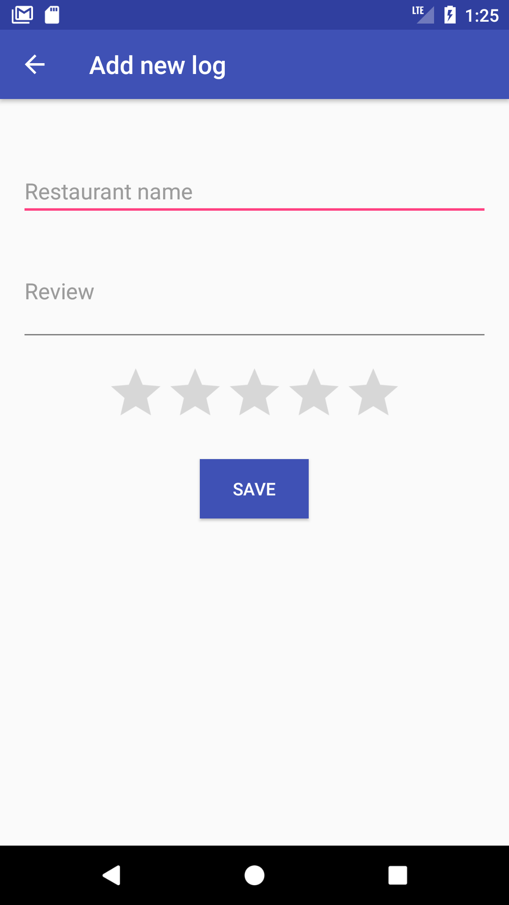
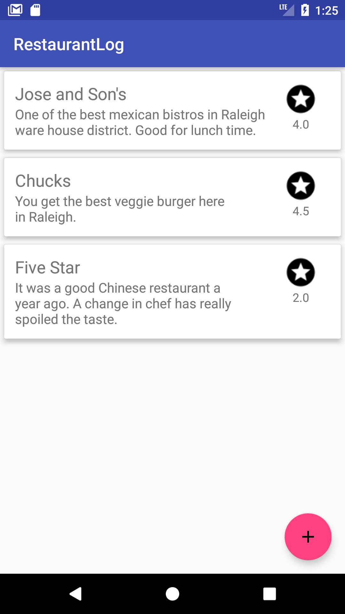

# Restaurant Log
Android app **Restaurant Log** is built to practice Kotlin and Android architecture components

##### Restaurant Log architecture

Tools used on the project
-----------------------------------------
* [Kotlin][1]
* [Android Architecture Components][2]
* [RxJava & RxAndroid][3]
* [Dagger 2][4]

[1]: https://kotlinlang.org/
[2]: https://developer.android.com/topic/libraries/architecture/index.html
[3]: https://github.com/ReactiveX/RxAndroid
[4]: https://github.com/google/dagger

#####Screenshots

