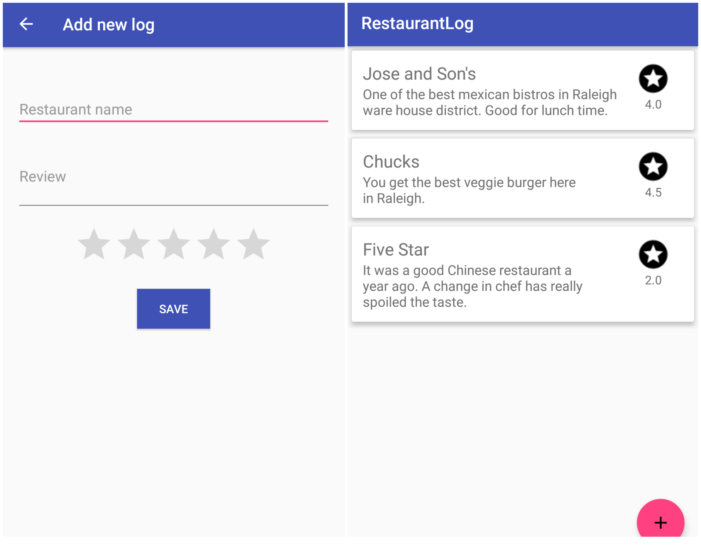

## Restaurant Log
Android app **Restaurant Log** is built to practice Kotlin and Android architecture components

#### Restaurant Log architecture

### What are the Android Architecture Components?
We know that writing quality software is hard and complex, it is not only about satisfying requirements and features. For some time, the community has been exploring various architectures and patterns to create better apps. Google had nothing on these topics until one year ago when they released Android Architecture Blue Prints a collection of samples to discuss and showcase different architectural tools and patterns for Android apps created by different developers round the world.

Couple moths ago, Google Launched the Android Architecture Components Framework. It is a set of libraries and guidelines that will help you design flexible, testable and maintainable apps, reduce boilerplate code, manage your UI components lifecycle and handle data, helping to create Android applications using separation of concerns (SoC).

### Components:
- Handling lifecycles: Set of classes and interfaces that allow you manage the lifecycle of an activity or fragment.
- Lifecycle: Is a abstract class that contains the information about the lifecycle state of a component.
- LifecycleRegistry: Is an explicit interface allows register an object to get the lifecycle state (looks LifecycleFragment or LifecycleActivity).
- LifecycleOwner: An interface with a single method to know that a component has a Lifecycle.
- Live Data: Observable with super powers basically keeps a value and allows this value to be observed it across lifecycle changes.
- ViewModel: A class designed to store and manage UI-related data so that the data survives configuration changes such as screen rotations.
- Room: Abstraction over SQLite to allow an easy database access (like an ORM or Object Mapping for SQLite).

### Tools used on the project
-----------------------------------------
* [Kotlin][1]
* [Android Architecture Components][2]
* [RxJava & RxAndroid][3]
* [Dagger 2][4]

[1]: https://kotlinlang.org/
[2]: https://developer.android.com/topic/libraries/architecture/index.html
[3]: https://github.com/ReactiveX/RxAndroid
[4]: https://github.com/google/dagger

#### Screenshots

